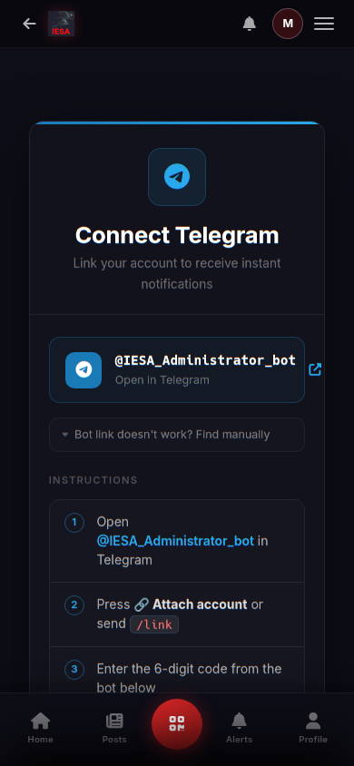
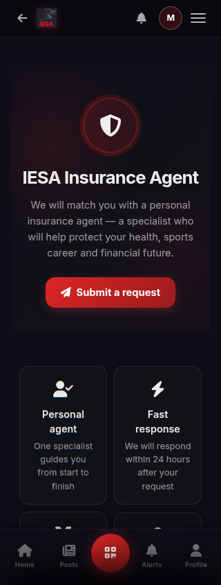
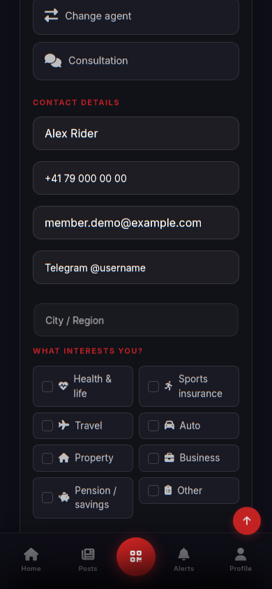
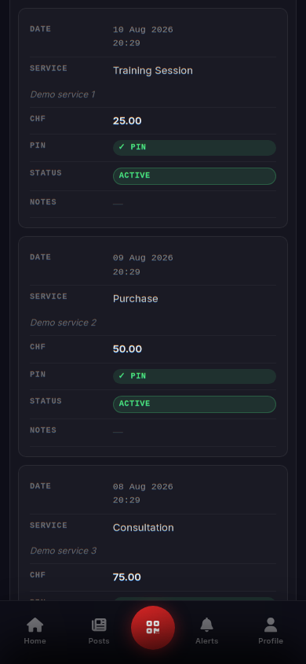
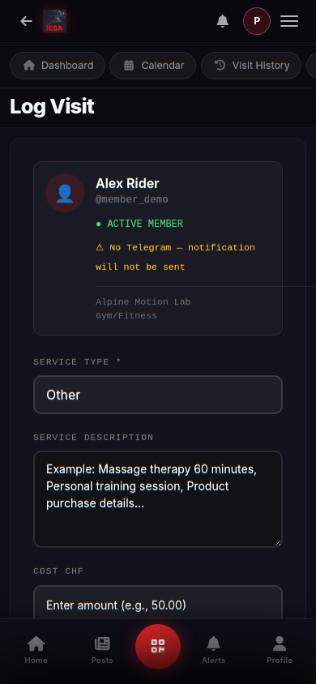
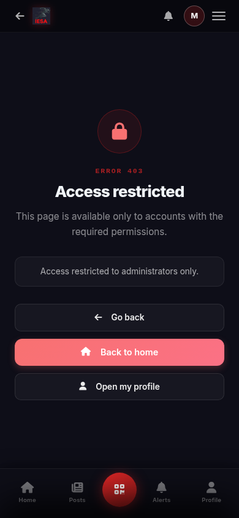

# Блок 02 — маршруты, мобильный UI и базовая доступность IESA

Дата: 10 августа 2026 года

Область: только IESA. Предвестник не изменялся.

## Итог

Выполнен первый полный маршрутный проход по публичной части, авторизации, кабинету участника, кабинету партнёра и staff-инструментам. Исправлены найденные функциональные и визуальные дефекты, после чего 32 основных экрана были повторно проверены в девяти ширинах: 320, 360, 390, 430, 768, 1024, 1280, 1440 и 1920 px.

Итог повторной автоматизированной матрицы: 288 из 288 сочетаний прошли без глобального горизонтального переполнения, без отсутствующего или дублирующего видимого `h1`, без видимых полей без программной подписи и без безымянных кнопок/ссылок.

Это не заявление о полном соответствии WCAG: отдельный глубокий проход с клавиатурой, экранным диктором, 200% zoom/reflow и всеми динамическими состояниями остаётся в следующих блоках.

## Исправленные функциональные ошибки

1. Анонимный переход в партнёрский кабинет возвращал HTTP 400 из-за неправильного построения `LOGIN_URL`. Теперь это безопасный 302 на страницу входа с корректным `next`.
2. На главной странице существовали два элемента с одинаковыми `id="partnerModal"` и `id="partner-modal-body"`. Дубликат удалён, modal-target теперь однозначен.
3. Staff-страница списка инвайтов падала с HTTP 500 из-за несуществующего шаблонного фильтра `split`. Заголовки таблицы заменены на штатную разметку Django.
4. Ссылка созданного инвайта и ссылка в staff-таблице вели на несуществующий `/users/invite/...`. Теперь URL строится через `reverse()` и ведёт на реальный `/auth/invite/...`.
5. История визитов не получала `edit_window_cutoff`, поэтому действия «изменить/отменить» никогда не отображались. Контекст исправлен; действие доступно только внутри разрешённых 20 минут.
6. Закрытый Telegram staff-инструмент отдавал белую страницу с голым текстом 403. Добавлена полноценная адаптивная страница с причиной отказа и безопасными следующими действиями.

## UI/UX и адаптивность

- История визитов партнёра на телефоне преобразована из обрезанной широкой таблицы в читаемые карточки «параметр — значение».
- Карточка участника в форме регистрации визита перестроена для узких экранов: имя, Telegram-статус и данные компании больше не сжимают друг друга.
- Экран подключения Telegram больше не принудительно фокусирует первое поле OTP при загрузке. На телефоне страница остаётся сверху, а клавиатура не открывается без действия пользователя.
- Страховой агент получил заметный CTA в hero, якорь к заявке, компактную сетку преимуществ и согласованные Font Awesome-иконки вместо разрозненных emoji.
- На 320–430 px форма интересов сохраняет двухколоночную плотность там, где это читаемо; все интерактивные элементы остаются внутри viewport.
- Staff-таблица инвайтов получила ограниченный горизонтальный контейнер, клавиатурный фокус и явную подсказку свайпа на телефоне.
- Удалён `autofocus` из поиска на 404, чтобы мобильная клавиатура не открывалась автоматически.

## Семантика и доступные имена

- Добавлены/исправлены `for` и `id` у фильтров постов, событий, глобального поиска, создания публикации, удаления профиля, формы страхования, календаря партнёра и формы визита.
- Добавлены подписи OTP-цифр и `role="group"` для шестизначного Telegram-кода.
- Добавлены доступные названия кнопкам закрытия, переключения месяцев и icon-only действиям.
- Главный заголовок добавлен карте партнёров и результатам поиска; иерархия Telegram-экрана исправлена с `h2` на `h1`.

## Визуальные доказательства текущего прогона

### Подключение Telegram, 390 px

### Страховой агент, 320 px

### Форма страхового агента, 390 px

### История визитов партнёра, 390 px

### Регистрация визита, 390 px

### Страница ограничения доступа, 390 px

## Проверки

- Повторная route/viewport-матрица: 288/288 без найденных нарушений заданных критериев.
- Полный тестовый набор IESA: 56/56 тестов успешно.
- Регрессионные тесты покрывают безопасный login redirect, единственный modal-target, заголовок карты, правильный invite URL, staff invite-list, 20-минутное окно визита и полноценную 403-страницу.
- `git diff --check`: без ошибок пробелов и конфликтных маркеров.

## Что намеренно не входит в этот блок

- Production SMTP/API-доставка от `iesa@iesasport.ch`, SPF, DKIM, DMARC и delivery-тесты — записаны отдельной будущей задачей.
- Разбор переданных production-логов — записан отдельной будущей задачей после завершения основной задачи №1.
- Полный secure recovery, patch notes, внутренний чат/Telegram feedback и стратегия немедленного обновления кэша — следующие отдельные блоки по ранее зафиксированному порядку.
- Глубокий аудит всех modal/error/loading/empty/HTMX-состояний, клавиатуры, zoom/reflow и экранного диктора продолжается в следующих UI/UX-блоках.
