# Полный аудит системы тем

Дата: 2026-08-02  
Охват: все 61 определение из `core/themes.py`, 14 премиальных шаблонов, мини-апп, команды `бот я / профиль / кто / анкета`, ширины 320/390/430 px.  
Режим: read-only. Код и данные тем не изменялись.

## Вердикт

Система функциональна, но как товарная витрина и дизайн-система пока неровная.

- В реестре 61 тема, но только 14 имеют самостоятельный премиальный шаблон. Остальные 47 используют один и тот же профиль: 41 отличается только эмодзи/разделителем, ещё 6 добавляют боковой символ.
- Из 14 премиальных тем пять — почти один и тот же каркас с переименованными блоками: `Бархат`, `Призма`, `Небесный`, `Витраж`, `Аурум`.
- На ширинах 320/390/430 px горизонтального переполнения нет ни у одной темы. Это хорошая техническая страховка, но не полноценная адаптация: на 320 px 48 из 61 превью получают дополнительные переносы, медианная высота блока — 654 px, максимум — 716 px.
- Навигация по данным лучше всего у `Linux`, `Starlight`, `System Override`, `Ветер Свободы` и `Авангард`. Хуже всего — у декоративно перегруженной `Империи` и у мифических тем, где один разделитель из эмодзи повторяется четыре раза.
- Мини-апп, бот и `бот анкета` показывают темы непоследовательно. Для 47 обычных тем web-preview и настоящее сообщение бота собираются разными ветками. `Бот анкета` вообще не использует 14 премиальных шаблонов и сводит дорогую тему к совместимым `top/sep/bot`-строкам.
- Локальный preview подменял полный реестр семью вымышленными/упрощёнными ID. Поэтому старые UI-тесты тем не доказывали качество фактических 61 тем.

Итоговая оценка текущей системы: **5.5/10**. Сильные отдельные шаблоны есть, но большая часть каталога ощущается как перекраска одного текстового каркаса, а не как самостоятельные темы.

## Что именно проверено

1. **Каталог в мини-аппе — частично здоров.** Цена и источник видны, карточки не растягивают страницу. Но каждый декоративный swatch обрезается, карточки не передают полный образ темы, а 9 тем за Зарники не попадают в фильтр `✨ Премиум` из-за привязки фильтра к редкости `zarniki`, а не к валюте/источнику.
2. **Web-preview — технически устойчив, визуально слишком длинный.** На всех трёх ширинах нет overflow; цена и действие честные. Но блок одной темы занимает 613–716 px, а кнопка `Купить/Надеть` имеет высоту 25 px.
3. **`бот я / профиль / стата / стат / мой профиль` — основной дизайн темы.** Все эти алиасы используют одну ветку; `бот кто` использует ту же композицию для чужого профиля. Внутри этой пары поведение согласовано.
4. **Web-preview против настоящего сообщения бота — расходятся у 47 тем.** Web-preview обычной темы показывает косметический титул и одну компоновку XP; бот использует другую компоновку, отдельную строку XP и титул не показывает. Совпадают только 14 премиальных шаблонов, потому что они делегируют общему renderer-у.
5. **`бот анкета` — отдельная несовместимая поверхность.** Она берёт только `top/sep/bot/accent` и игнорирует `premium_template`. Поэтому `Linux`, `Империя`, `Starlight` и остальные дорогие темы в анкете теряют уникальную структуру.
6. **Награды БП/гачи — только имя.** В этих местах дизайн темы не рендерится; показывается название награды. Это нормально, но карточка/превью в мини-аппе остаётся единственным способом оценить покупку до экипировки.

## Responsive-проверка

| Ширина | Нет горизонтального overflow | Темы с дополнительным переносом | Медианная высота preview | Максимум |
|---:|---:|---:|---:|---:|
| 320 px | 61/61 | 48/61 | 654 px | 716 px |
| 390 px | 61/61 | 47/61 | 638 px | 716 px |
| 430 px | 61/61 | 47/61 | 638 px | 700 px |

Что это означает:

- Верстка не ломается, но `word-break: break-word` маскирует слишком длинные исходные строки. На 320 px длинные имена питомцев распадаются посреди смыслового блока.
- Обычная тема содержит около 30 жёстких строк, премиальная — 31–35. Это скорее полный отчёт, чем лаконичный профиль.
- Увеличение ширины почти не сокращает высоту премиум-тем: основная длина задана десятками фиксированных строк, а не переносами.
- Плавающая `Примерочная` и нижняя навигация закрывают нижнюю часть preview на всех проверенных ширинах.

## Качество дизайна по каждой теме

Шкала: **A** — сильная самостоятельная тема; **B** — хорошая основа; **C** — рабочая, но похожа на заполнитель каталога; **D** — слабо соответствует цене/обещанию.

### Обычные

| Тема | Оценка | Наблюдение |
|---|:---:|---|
| 🌑 Тень | B | Лучший базовый минимализм; линия спокойная, но четыре одинаковых разделителя всё равно избыточны. |
| 🌅 Рассвет | C | Пара эмодзи понятна, но обещанные «оранжево-золотые тона» Telegram-текст не создаёт. |
| 🌆 Закат | C | Отличается от Рассвета почти только эмодзи; сиреневая палитра существует только в описании. |
| 🪨 Камень | C | Мотив читается, но «тяжёлые рамки» фактически тот же разделитель. |
| 🍃 Лист | C | Чистая пара 🍃/🌿, но самостоятельного характера мало. |

### Необычные

| Тема | Оценка | Наблюдение |
|---|:---:|---|
| 🍂 Осень | C+ | Цветовая ассоциация считывается через эмодзи; конструкция полностью типовая. |
| 🌊 Океан | C+ | Спокойный мотив, но нет обещанных «пенных завитков». |
| ❄️ Снег | C+ | Читается мгновенно; визуально почти не отличается от остальных природных тем. |
| 🏜️ Мираж | C | Пустыня понятна, сам эффект миража не выражен. |
| 🎋 Дзен | B- | Бамбук и чай хорошо поддерживают спокойный характер; один из лучших простых наборов элементов. |

### Редкие

| Тема | Оценка | Наблюдение |
|---|:---:|---|
| 🌸 Сакура | B- | Гармоничная пара 🌸/🍃, но это всё ещё обычный профиль с цветочным разделителем. |
| ⛩️ Тории | B- | Сильная тема входа/фонарей; визуального развития после шапки нет. |
| 🎏 Карпы Кои | B- | Кои + вода подобраны логично; повторение узора делает сообщение шумнее. |
| 🗻 Фудзи | B- | Хорошо узнаётся и звучит спокойно; не хватает уникальной композиции. |
| 🔥 Пламя | C | Яркая пара, но «пульсация» из описания отсутствует. |
| 🧊 Лёд | C+ | Кристаллический мотив читается, однако структура не становится острее или чище. |
| ⚡ Буря | C+ | Энергичный набор, но повтор молний быстро утомляет. |
| 🌙 Лунная | C+ | Понятная и спокойная, очень близка к десяткам других эмодзи-тем. |
| 🌺 Алая Вишня | C | 🌺 — не цветок вишни; заявленная японская каллиграфия нигде не появляется. |
| 🐋 Бездна | C+ | Кит и вода дают глубину, но «давление» и бездна не выражены композицией. |
| 🔮 Аметист | C | Фиолетовый камень заявлен, но визуально это универсальные 🔮/💎. |

### Эпические

| Тема | Оценка | Наблюдение |
|---|:---:|---|
| 🪭 Гейша | C+ | Веер и кимоно сочетаются, но эпическая редкость не даёт нового макета. |
| 🌌 Космос | C+ | Мотив красивый, но не отличим по структуре от редких тем. |
| 🐲 Дракон | C+ | Дракон/огонь/сокровище связаны хорошо; повтор эмодзи заменяет настоящий «чешуйчатый» ритм. |
| 💜 Неон | D+ | Описание обещает неоновые контуры, которых Telegram HTML не умеет показывать; остаются 💜 и ⚡. |
| 🪷 Нефрит | C | 💚/🪷 передают зелёный Восток, но почти не передают камень нефрит. |
| ⚙️ Механизм | C+ | Стимпанк считывается через ⚙️/⏳, но отдельного механического каркаса нет. |
| 👾 Глитч | D+ | Нет глитча, сбоя или цифрового ритма — только типовой разделитель с 👾/🔌. |

### Легендарные

| Тема | Оценка | Наблюдение |
|---|:---:|---|
| 🔮 Предвестник | B- | Лорово уместна, боковой 💜 помогает имени; всё ещё не выглядит как уникальный дорогой шаблон. |
| 🦅 Феникс | B- | Огонь хорошо работает, но 🦅 читается как орёл, а не феникс. |
| 👑 Королевский | C | Стоит 400 ✨, но использует обычный каркас; по ценности заметно проигрывает premium-template темам. |
| 🌌 Сияние | B- | Спокойнее большинства; 🌌/🌠 не передают именно северное сияние. |
| 🃏 Оракул | B- | Таро и глаз создают характер, боковой символ помогает иерархии. |
| 🕊️ Валькирия | B- | Сдержанно и читаемо; голубь больше означает мир, чем воительницу. |

### Мифические

| Тема | Оценка | Наблюдение |
|---|:---:|---|
| 🌑🌟 Затмение | D | 500 ✨ за обычный каркас; длинная гирлянда 🌑🌟 повторяется и забивает данные. |
| ⚫ Пустота | C- | Чуть лаконичнее Затмения, но цена не поддержана уникальной композицией. |
| 🩸 Кровавая Луна | D | Самая шумная стандартная тема: красно-жёлтый паттерн доминирует над профилем и повторяется четыре раза. |

### Теневые

| Тема | Оценка | Наблюдение |
|---|:---:|---|
| 💀 Теневой Торговец | C | Череп/сердце передают тьму, но описанный силуэт торговца отсутствует. |
| 🔒 Запретный | C+ | Цепи и замки согласованы; повторение делает рамку монотонной. |
| 👁 Изгнанник | C+ | Глаз — сильный центральный знак; заявленный «красный глаз» не гарантирован. |
| 🪦 Жнец | C+ | Могила и увядший цветок хорошо держат настроение; структура стандартная. |

### Зарниковые premium-template

| Тема | Оценка | Наблюдение |
|---|:---:|---|
| 🌌 Starlight | A- | Сильный космический dashboard и понятные блоки; 33 строки и переименование питомцев в «дронов» повышают когнитивную цену. |
| 🟪 Бархат | B- | Настроение цельное, но `Ларец/Шёпоты/Тени` — один из пяти одинаковых каркасов с заменёнными словами. |
| 🌈 Призма | B | Чистый ритм и хорошие секции; радужность ограничена эмодзи. |
| ☀️ Небесный | B | Иерархия понятная, но `Грех/Святость` переименовывают системные показатели и замедляют чтение. |
| 💠 Витраж | C+ | Красиво в шапке, дальше почти полная копия Призмы с другими существительными. |
| ⚜️ Аурум | B- | Золотой словарь цельный; количество однотипных золотых маркеров делает блок монотонным. |
| 💻 System Override | A- | Один из самых самостоятельных дизайнов; хорошо сканируется технической аудиторией, но 35 строк и аббревиатуры тяжёлы для остальных. |
| 🎐 Ветер Свободы | A- | Лучшее сочетание японского характера и читаемой иерархии; длинная шапка и 32 строки всё ещё не лаконичны. |
| ⚜️ Империя | C | Орнаментальные Unicode-глифы выстраиваются нестабильно в пропорциональном шрифте; шаблон ещё и теряет предупреждения, общее число сообщений и пассивного питомца. |
| 🐧 Linux | A- | Самая понятная техническая тема: привычные секции, короткие метки, хорошая плотность. Ниша узкая, но обещание выполнено. |
| 🖥️ Hardcore Shell | B+ | Строго, компактно и узнаваемо; английские сокращения подходят только части аудитории. |
| 🎭 Закрытый Орден | B | Цельный язык ложи и хорошая сетка; `Фонд/Слухи/Союзы` замедляют поиск привычных данных. |
| 💠 Prism OS | B- | Технически аккуратно, но слишком близко к System Override/Linux и слабее их по собственной идее. |
| 🕊️ Авангард | A- | Самый лаконичный premium-template: короткие секции, мало декоративного шума, данные хорошо сканируются. |

### Сезонные

| Тема | Оценка | Наблюдение |
|---|:---:|---|
| 🎆 Новый Год | C+ | Узнаваемо и празднично; обычный каркас не делает сезонную награду особенной. |
| 🌻 Солнцестояние | C+ | Солнце/подсолнух/вода связаны хорошо; уникальной структуры нет. |
| 🎃 Самайн | B- | Лучший сезонный набор элементов: тыквы, мыши, паутина читаются сразу. |
| 💌 Цветение | C | Фактически тема Дня влюблённых, а не широкого «весеннего цветения». |
| 🎰 Азарт | B- | Масти и казино дают сильный характер; перегруженность умеренная. |
| 🎫 Предвестник Сезона | B- | Лор награды и трофейный мотив хороши, но эксклюзив БП выглядит как ещё одна стандартная рамка. |

## Системные слабые места

### 1. Описание часто обещает то, чего канал не умеет показать

Telegram HTML не задаёт цвет текста, свечение, пульсацию, каллиграфию или контуры. Поэтому описания вроде «сиреневые тона», «пульсирующий оранжевый», «неоновые контуры» и «переливающееся сияние» фактически реализованы только выбором эмодзи. Это снижает доверие к покупке.

### 2. Тематический язык мешает ориентироваться

Переименование стабильных данных создаёт характер, но игрок вынужден каждый раз учить новый словарь: Мора становится `Пылью`, `Нитями`, `Фотонами`, `Слитками`, `Монетами`; статистика — `Журналом`, `Шёпотами`, `Логами`, `Приёмами`. Иконки частично спасают, но быстрый поиск баланса, предупреждений и активности замедляется.

### 3. Информационный контракт не одинаковый

- `Империя` не показывает `warns`, общее число сообщений и пассивного питомца.
- Ни один из 14 premium-template не использует доступное поле косметического титула.
- Стрик присутствует в обычном профиле, но отсутствует во всех 14 premium-template.
- У 47 обычных тем web-preview и реальный бот-профиль различаются.
- `Бот анкета` игнорирует premium-template полностью.

Это уже не полировка: дорогая тема может скрывать часть полезной информации.

### 4. Премиум-фильтр не соответствует покупке за Зарники

Фильтр строится по `rarity == zarniki`. Поэтому за его пределами остаются девять тем с ценой в Зарниках: `Королевский`, три мифические и пять сезонных. Игрок видит дорогой товар за ✨, который интерфейс не считает премиальным.

### 5. Локальные моки не защищают production-каталог

В реестре 61 ID вида `theme_*`, а preview отдавал только 7 сокращённых ID (`classic`, `starfall`, `bloodmoon` и другие). В результате тесты могли быть зелёными при проблеме в любой из 54 неохваченных тем и при рассинхронизации самих ID.

## Приоритет рекомендаций

1. **P0 — единый контракт данных.** Зафиксировать обязательные поля для всех тем и запретить шаблону скрывать предупреждения, all-time статистику, титул, стрик или питомца.
2. **P0 — реальные тестовые данные.** Генерировать local-preview темы из `core/themes.py`, а не поддерживать отдельный список из семи моков.
3. **P1 — один renderer на всех поверхностях.** Web-preview, `бот я/кто` и `бот анкета` должны использовать одну модель темы с вариантами `full/compact`, а не три независимые сборки.
4. **P1 — responsive-бюджет.** Ввести проверку 320/390/430 px, лимит длины ключевой строки и golden-снимки реального Telegram-клиента; отсутствие overflow не считать достаточным.
5. **P1 — честный premium-фильтр.** Отделить способ оплаты/сегмент от rarity, чтобы все товары за Зарники находились ожидаемо.
6. **P2 — сократить стандартный каркас.** Оставить 2 смысловых разделителя вместо 4, разбить длинную строку питомца заранее и не повторять один эмодзи-паттерн на каждом блоке.
7. **P2 — развести уровни ценности.** Common/uncommon могут быть простыми рамками; rare/epic должны менять композицию; legendary/mythic и дорогие Зарниковые должны получать самостоятельные шаблоны.
8. **P2 — стабильные подписи.** Сохранять понятные названия `Мора`, `Алмазы`, `Активность`, а тематический язык использовать как вторичный акцент.
9. **P3 — обновить тексты обещаний.** Описание должно называть реальный вид сообщения, а не несуществующие цвета/анимации.

## Визуальные доказательства

### Базовый и стандартный каркас

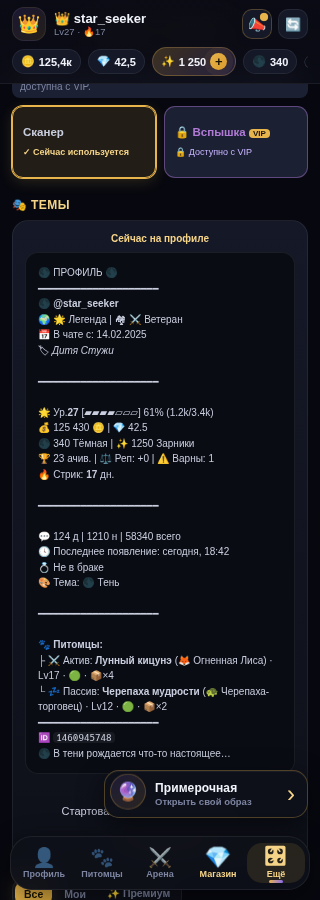
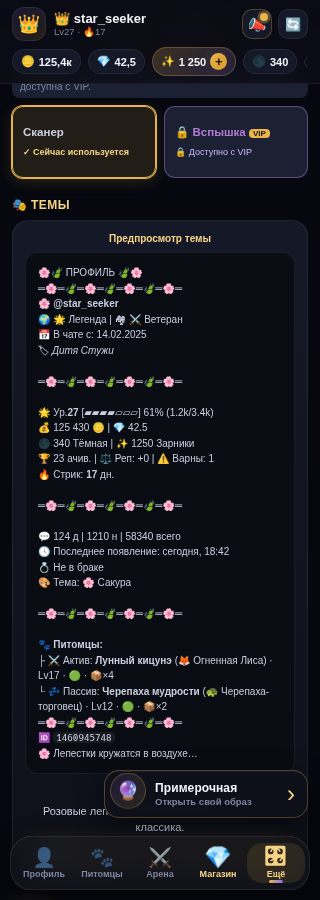
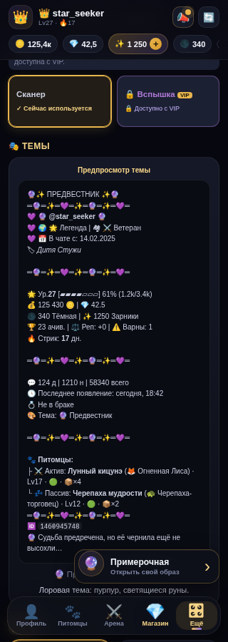
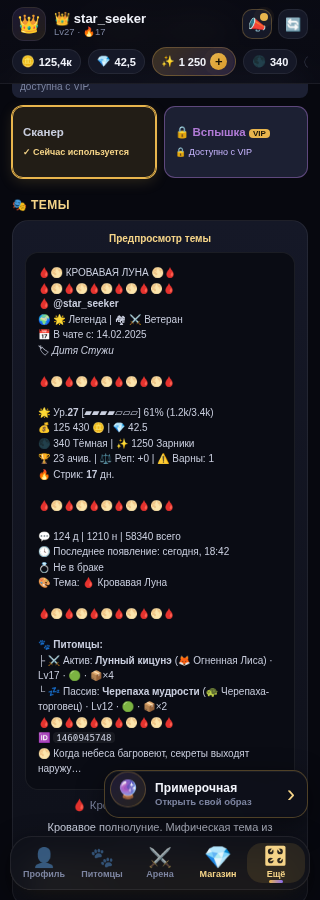
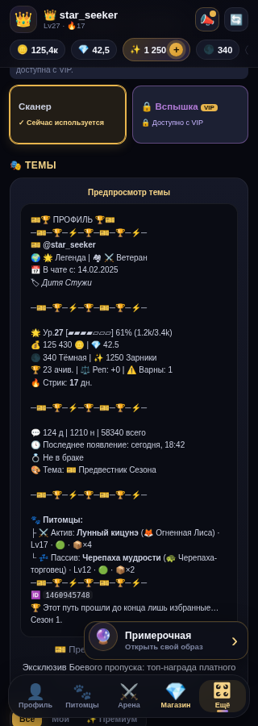

### Все 14 premium-template

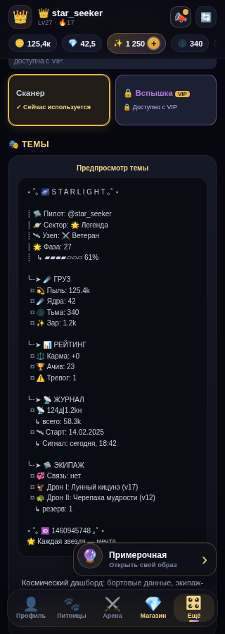
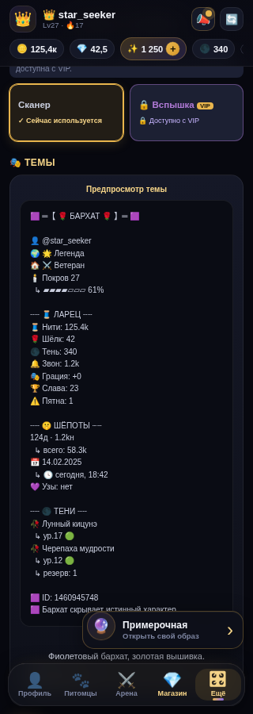
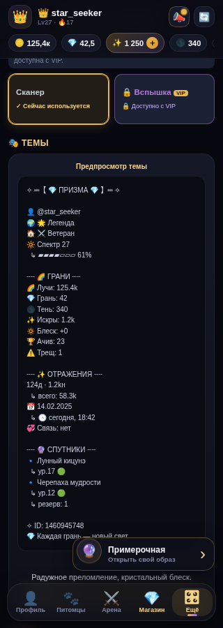
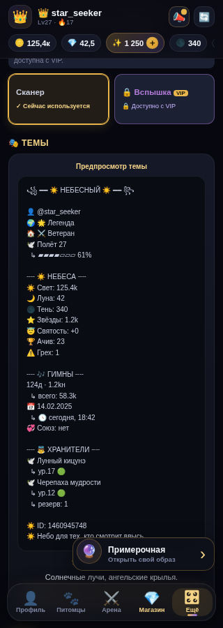
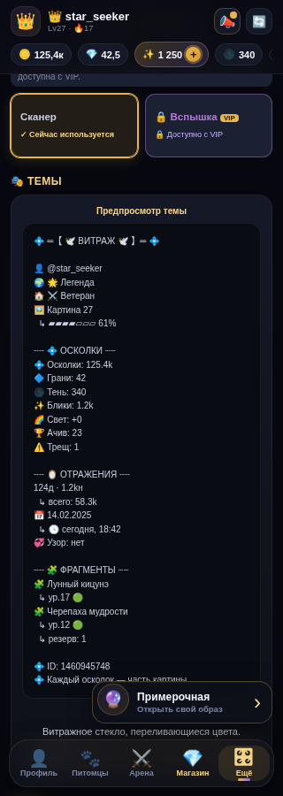
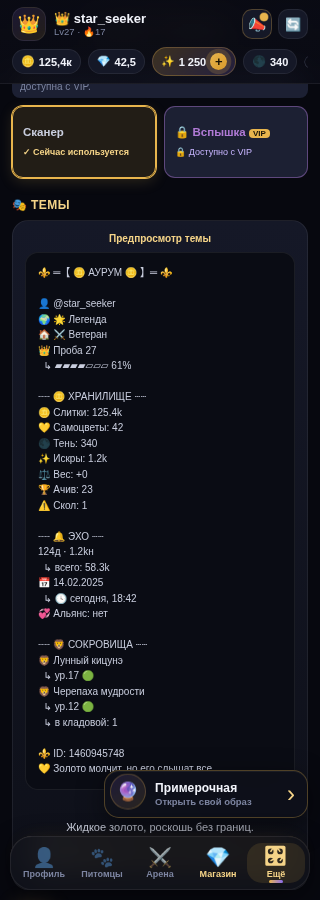
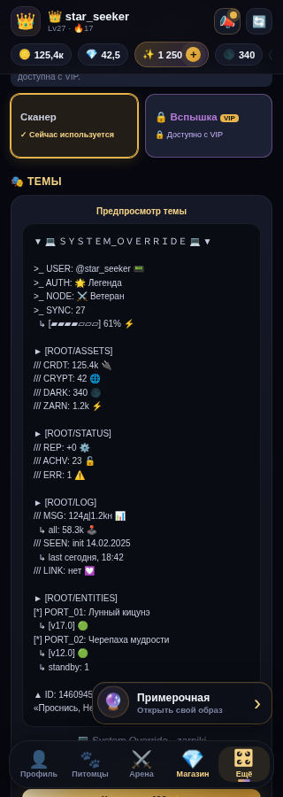
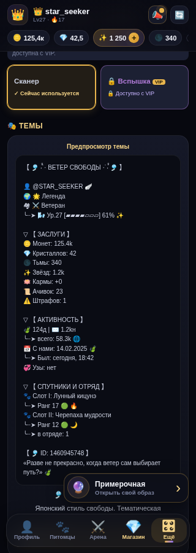
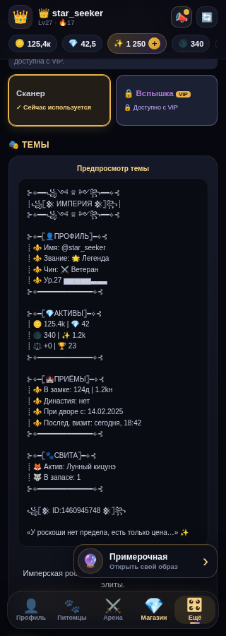
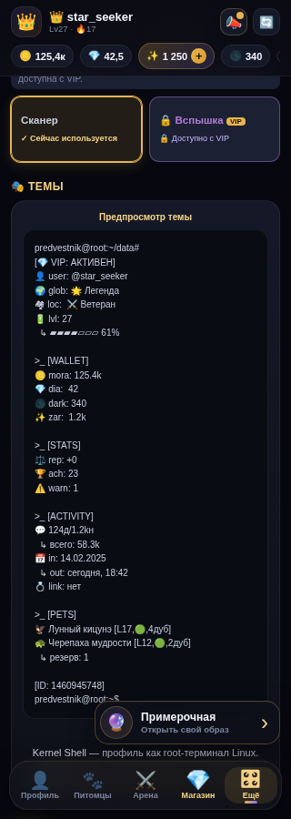
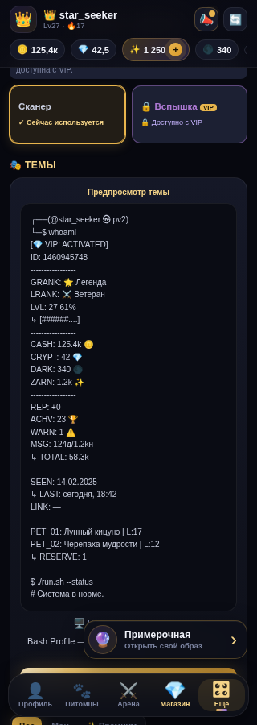
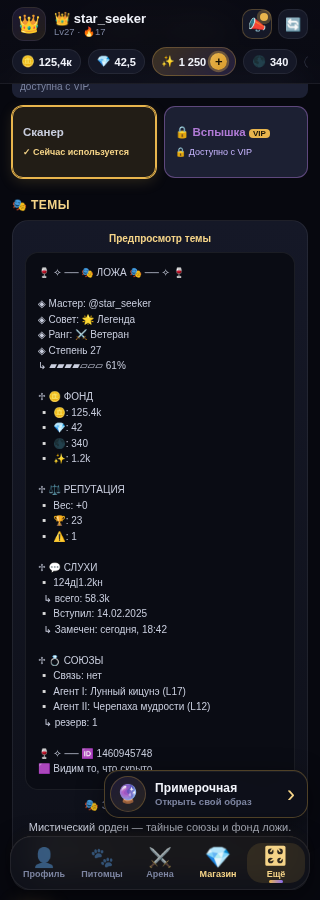
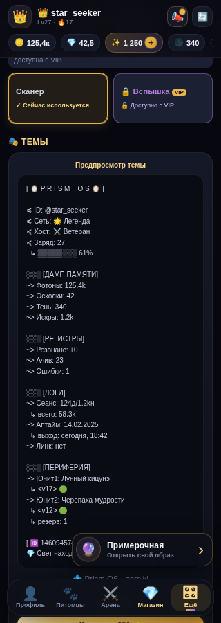
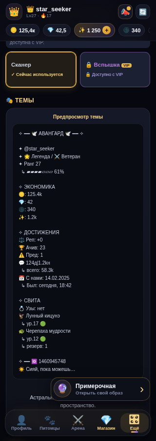

### Сравнение рискованных тем на 430 px

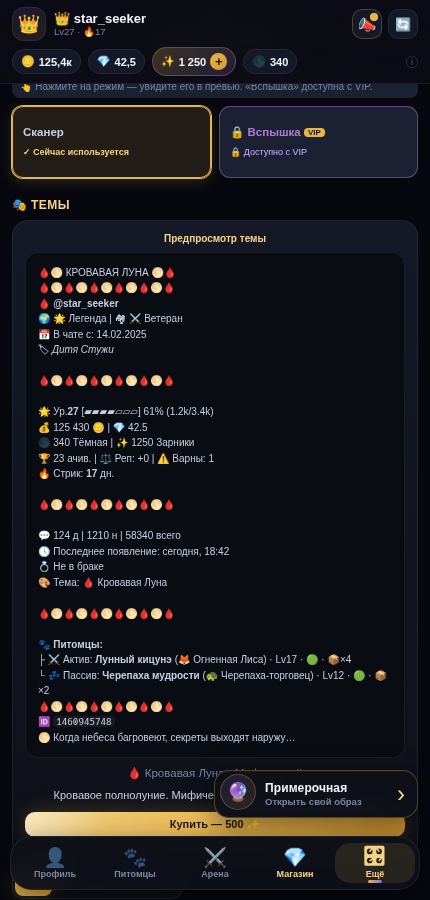
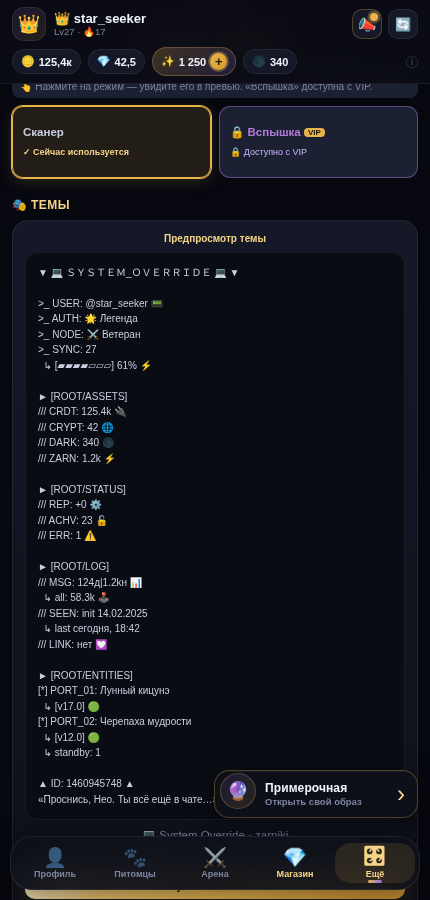
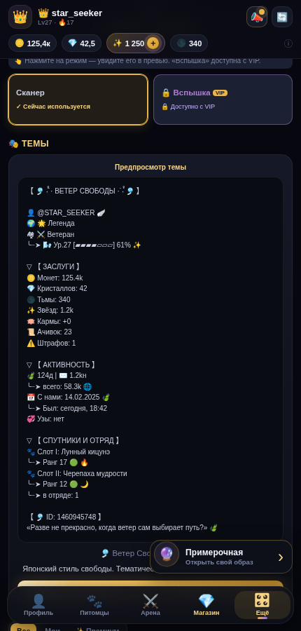
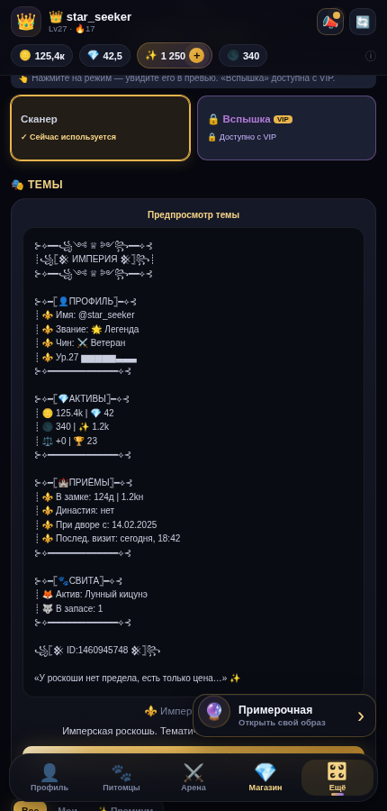
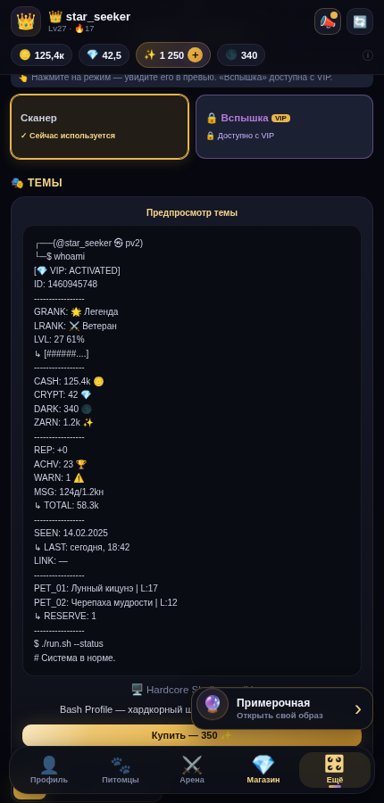

## Ограничения доказательств

- Тексты 14 premium-template отрендерены реальным общим renderer-ом. Для обычных тем диагностический рендер повторяет две фактические ветки сборки из web и bot-кода на одинаковых данных.
- Прямого подключения к Telegram-клиенту в локальном стенде нет. Поэтому переносы внутри настоящего Android/iOS Telegram требуют отдельного device-run; web использует заявленный в проекте системный пропорциональный шрифт и тот же HTML.
- DB-overrides Theme Lab не проверялись без production read-only доступа. Отчёт оценивает исходные шаблоны репозитория.
- Аудит не изменял код тем и не утверждает WCAG-соответствие.
