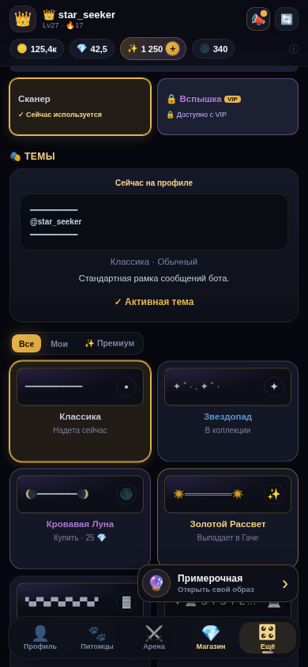
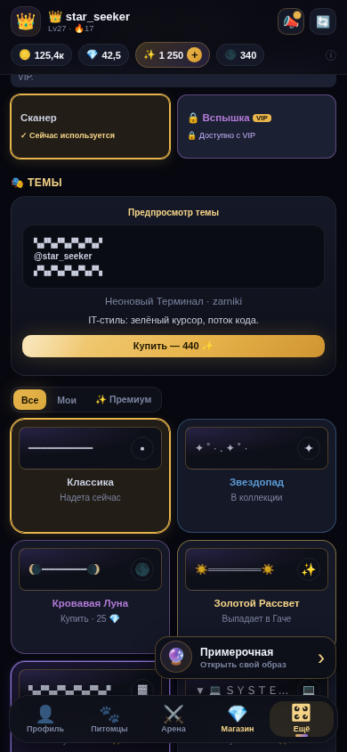
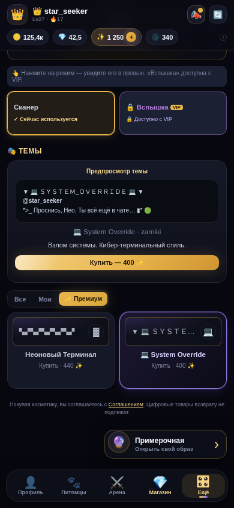
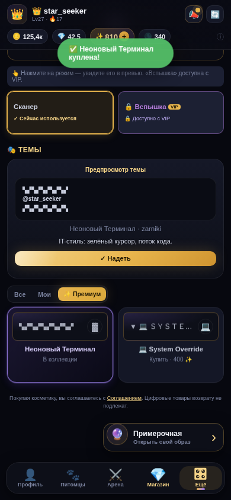
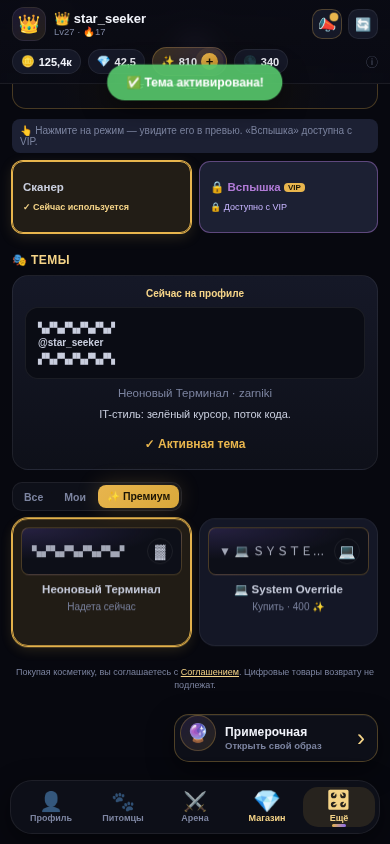
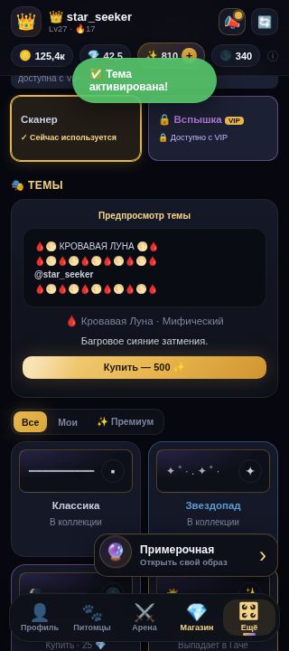

# Аудит раздела «🎭 Темы»

Дата: 2026-08-02  
Контур: локальный preview, мобильные viewport 390×844 и 320×720  
Сценарий: просмотр каталога → фильтр «Премиум» → покупка → экипировка → узкий экран  
Ограничение: это только аудит. Production-код тем не изменялся.

## Общий вердикт

Путь покупки работает и честно показывает цену, валюту и состояние предмета. Но витрина тем визуально слабее новой косметики и пока недостаточно объясняет, как тема будет ощущаться в реальном чате. Главные структурные риски: две разные темы с одинаковым названием, дорогая тема вне фильтра «Премиум», несемантические карточки и слишком низкие кнопки действий.

## Сценарий по шагам

### 1. Вход в раздел — частично здоров

- Хорошо: активная тема явно отделена от каталога; цена и способ получения видны до клика; горизонтального переполнения нет.
- Риск: две карточки называются «Кровавая Луна», хотя одна стоит 25 💎, а другая 500 ✨. Пользователь не может быстро понять, это улучшенная версия, дубликат или ошибка.
- Риск: плавающая «Примерочная» перекрывает нижний ряд тем, хотя пользователь уже находится внутри «Внешнего вида».
- Полировка: карточки различаются главным образом текстовыми разделителями и акцентным цветом. Дорогие темы не создают ощущения более редкого продукта.

### 2. Предпросмотр платной темы — логика здорова, представление слабое

- Хорошо: цена `440 ✨` показана прямо на кнопке; покупка не скрыта за промежуточным действием.
- Риск: предпросмотр демонстрирует одну искусственную строку вокруг ника, а не реальный фрагмент сообщения бота. Нельзя оценить длинный ник, несколько строк, текст ответа, служебную подпись и читаемость в настоящем чате.
- Риск: в интерфейсе показан технический тип валюты `zarniki` вместо нормального пользовательского названия.
- Доступность: высота основной кнопки — 25 px, существенно меньше комфортной мобильной области касания около 44 px.

### 3. Фильтр «✨ Премиум» — технически работает, каталог непоследователен

- Хорошо: активный фильтр хорошо заметен; длинная тема не ломает ширину экрана.
- Риск: фильтр показывает только две темы по 400–440 ✨, но тема «Кровавая Луна» за 500 ✨ в него не входит. Цена и премиальность расходятся, поэтому фильтр не соответствует ожиданию игрока.
- Риск: даже у дорогой темы визуальный образ почти целиком собран из текста и символов; ценность ощущается как форматирование строки, а не как законченная тема чата.

### 4. После покупки — здорово

- Хорошо: покупка подтверждается отдельным сообщением; баланс меняется; кнопка превращается в однозначное действие «Надеть».
- Риск: уведомление занимает верхнюю центральную область и перекрывает часть интерфейса. Для короткого состояния это терпимо, но его надо проверять с длинными локализованными сообщениями.
- Доступность: кнопка «Надеть» также имеет высоту 25 px.

### 5. После экипировки — здорово

- Хорошо: сразу меняются заголовок, карточка, состояние предпросмотра и уведомление; игрок понимает, что тема уже активна.
- Риск: подтверждение состояния опирается на цвет и мелкий текст. Для ассистивных технологий динамическое сообщение нужно отдельно проверять через live-region.

### 6. Узкий телефон — верстка устойчива, плотность чрезмерна

- Хорошо: при ширине 320 px нет горизонтального переполнения, цена и основное действие остаются видимыми.
- Риск: плавающая «Примерочная» и нижняя навигация одновременно перекрывают существенную часть каталога.
- Риск: длинный орнамент из повторяющихся эмодзи выглядит шумно и сильнее конкурирует с ником, чем подчёркивает его.
- Полировка: вторичная подпись карточек имеет размер 10 px и слабый контраст — на небольшом экране её приходится всматриваться.

## Приоритет слабых мест

1. **P1 — доступность управления.** Все карточки тем — `DIV` без `role`, `tabindex` и клавиатурного действия; при этом фильтры корректно сделаны кнопками. Карточки нельзя считать доступными без переделки семантики и проверки фокуса.
2. **P1 — конфликт каталога.** Развести две «Кровавые Луны» по названию, описанию и визуальному обещанию либо явно оформить одну как эволюцию другой.
3. **P1 — премиальная классификация.** Синхронизировать фильтр с продуктовой логикой: тема за 500 ✨ не должна выглядеть случайно исключённой из премиум-сегмента.
4. **P1 — мобильные действия.** Увеличить интерактивную область «Купить/Надеть» и проверить все карточки на минимальный touch target.
5. **P2 — правдивый предпросмотр.** Показывать тему на 2–3 реалистичных сообщениях бота, включая длинный ник и многострочный текст, а не только на декоративной строке.
6. **P2 — ценность дорогих тем.** У каждой премиальной темы нужен самостоятельный характер: композиция верх/низ, акцент ответа, системные маркеры и спокойная читаемость. Сейчас различия слишком завязаны на повторяющиеся символы.
7. **P2 — перекрытие контента.** Внутри раздела тем уменьшать или прятать плавающую «Примерочную», чтобы она не закрывала карточки.
8. **P3 — копирайт и читаемость.** Убрать `zarniki` из пользовательского текста, увеличить вторичные подписи и перепроверить контраст.

## Границы доказательств

- Проверены локальные текущие данные и состояния, а не production-каталог.
- Скриншоты не доказывают WCAG-соответствие. Нужны отдельные проверки клавиатуры, screen reader, контраста и объявления динамических состояний.
- Не проверялось реальное отображение тем в Telegram-сообщениях: текущий интерфейс не показывает полноценный чатовый пример.
- В рамках запроса изменения в темы не вносились.
