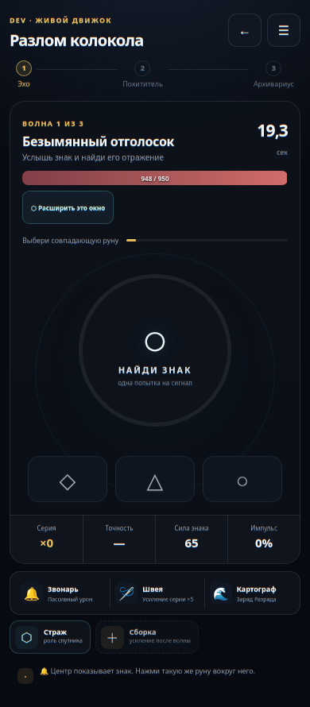
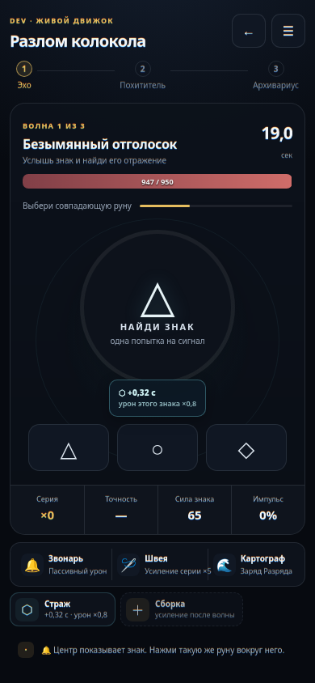
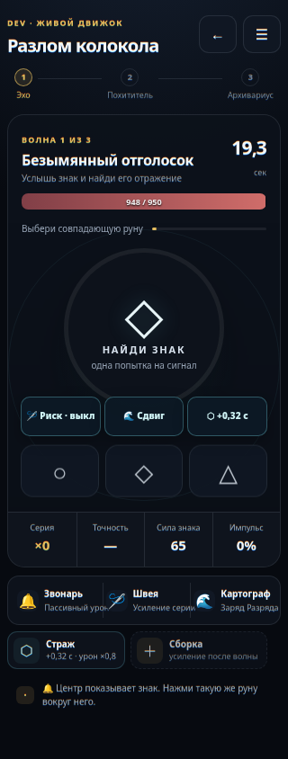
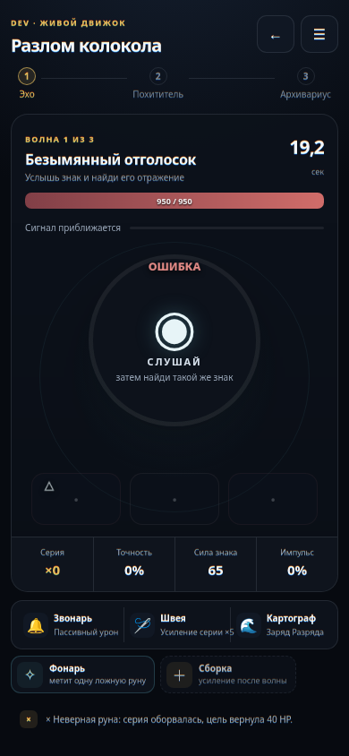
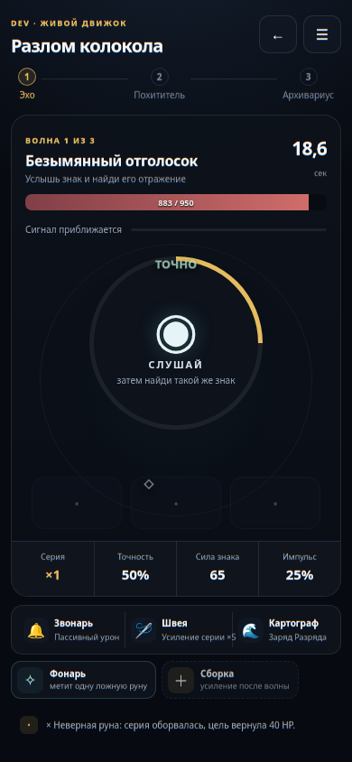
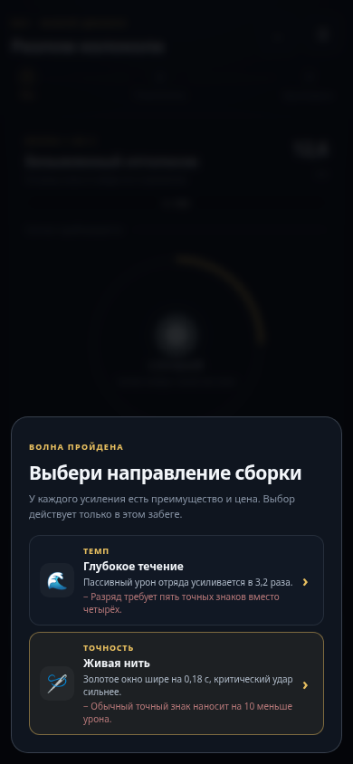
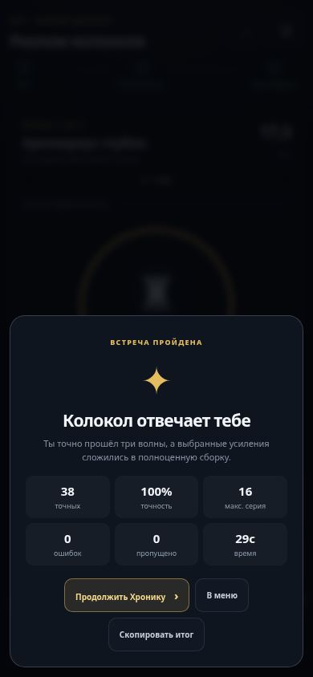
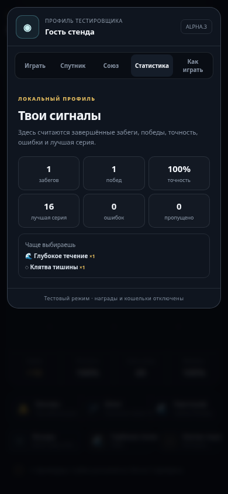

# Ревизия кликера — 22 августа 2026

## Вердикт

Основной мобильный поток отполирован и проверен на ширинах 320, 390, 430 и 1024 px. Навыки находятся рядом с рунами, не перекрывают центральную инструкцию и остаются доступными при трёх одновременных действиях. Критические игровые подписи теперь имеют размер не меньше 9 px, а основной текст действий — не меньше 10 px.

## Проверенный путь

1. **Главное меню — здорово.** Правило первого забега объясняет одно конкретное действие вместо общих обещаний.
2. **Ожидание и выбор руны — здорово.** Знак, одна попытка, таймер, здоровье и текущая цель читаются без прокрутки.
3. **Навыки в активном окне — здорово.** Кнопки находятся прямо над рунами, имеют цель касания от 44 px и не пересоздаются между серверными кадрами.
4. **Несколько навыков на 320 px — здорово.** Три действия помещаются в одну строку и не закрывают знак или инструкцию.
5. **Ошибка и точный ответ — здорово.** Короткие подтверждения находятся над ядром; подробное последствие остаётся в журнале события.
6. **Выбор усиления — здорово.** На карточке одновременно видны преимущество, ограничение и срок действия выбора.
7. **Итог забега — здорово.** Победа, точность, ошибки, пропуски, серия и время собраны в одном экране; основные действия компактны.
8. **Статистика — здорово.** Нулевая точность показывается как «—», а после забега отображаются только рассчитанные показатели.

## Что исправлено

- Панель навыков перенесена из верхней части боя к рунам.
- Убрана горизонтальная прокрутка боевых навыков.
- Для навыков показаны конкретный эффект и цена применения.
- Частое обновление состояния больше не заменяет активную кнопку новым DOM-элементом и не может съесть нажатие.
- Увеличены и осветлены мелкие подписи здоровья, цели, отряда, сборки, событий, питомцев и статистики.
- Общие фразы про «гринд», «продажу силы» и тестовые контуры заменены проверяемыми правилами.
- Английские пользовательские подписи `Bond`, `Practice`, `SHADOW` и `onboarding` заменены русскими формулировками.
- Добавлена спокойная визуальная реакция «ТОЧНО», «ОШИБКА» и «РАЗРЯД», не перекрывающая центральную инструкцию.
- Проверено, что ошибка не открывает чужую модалку, а пауза не двигает таймер и интерфейс.

## Кадры

### До: навык далеко от рун и набран слишком мелко

### После: навык рядом с зоной решения

### Три навыка на узком экране

### Ошибка и восстановление

### Выбор усиления и итог

## Границы проверки

Скриншоты подтверждают компоновку, читаемость и отсутствие визуальных перекрытий. Браузерный прогон подтверждает размеры целей, отсутствие переполнения, корректные модальные состояния и полный забег со 100% точностью. Реальную силу вибрации Telegram WebApp и поведение экранного диктора нужно дополнительно проверять на физическом телефоне; из скриншотов это доказать нельзя.
